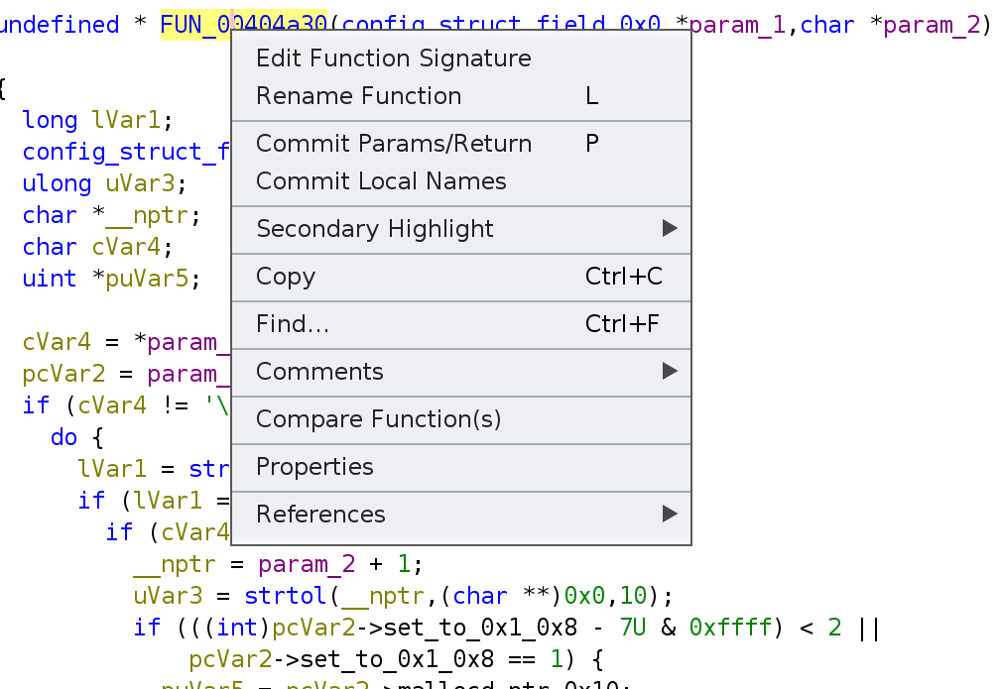
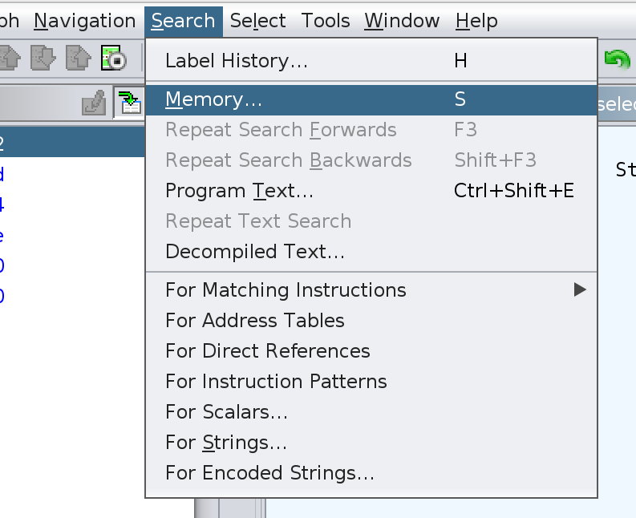
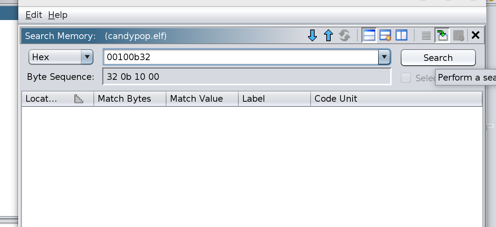
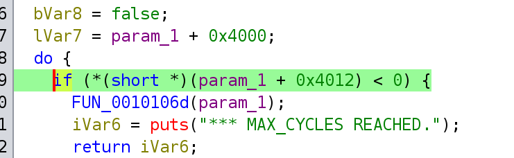
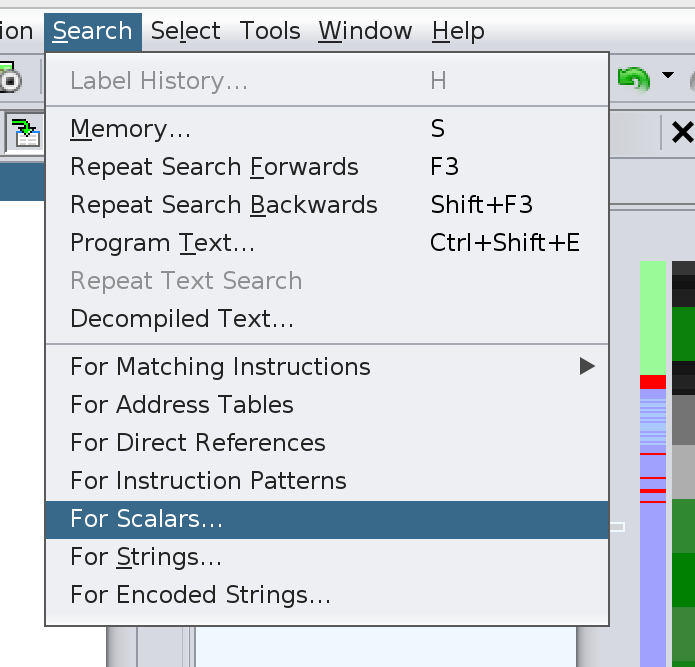
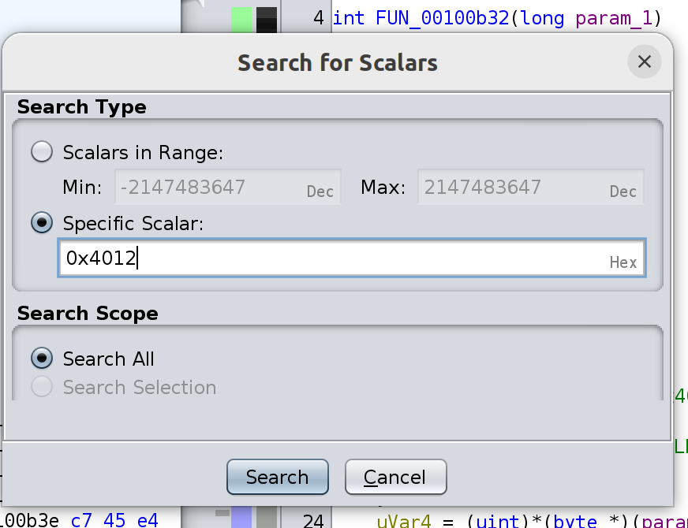

# ghidra_conventions
Conventions that seem pretty useful for ghidra. Most of these are meant to:
- make long-term reverse engineering projects more stable
- prevent the project from degrading over a long period of time
- save time while reversing

# Guidelines
- You should be creating types and applying them to the project. This is one of the major features that modern RE tools offer and most rely on you as a user to do this.
- You should be applying types to function signatures, even if it looks like the type of an argument is already correct. Ghidra does not save any types to function parameters or returns unless you run the "Commit Params/Return" option. Types that are committed propagate non-persistently up to functions that call your function, so this will frequently set types of local variables correctly if you start doing it. The more frequently a function is used, the more this will fix up your decompilation across the whole project.

- Try to fully define structures and their uses sooner rather than later. If you are able to find where a structure is allocated, initialized, or printed out, define that struct there as much as you can first rather than using the "Auto Create Structure" option. Identifying the actual size of a struct, some of the functions that use a struct as a parameter/return, and identifying a location that you know for certain is associated with a specific structure is very helpful for ensuring that analysis later on is consistent and does not make bad assumptions.
- TODO: include picture and example showing a memcpy of an internal field at offset 0 can lead to an incorrect assumption about the structure size

# Principles
- Ideally, you want the decompiled code to look pretty close to c

# How-to's
## Identifying missing cross-references to a function
Ghidra frequently misses cross references to functions if the reference is a pointer embedded in the data section of the binary. You can resolve this by searching for the packed version of the address in the "Search Memory" window. Remember to add 1 to your address if searching a function in thumb mode.

## Identifying accesses to a structure's field across the binary (even if everything isn't typed correctly)
It is common to want to identify all accesses to a specific field in a structure across a whole binary, but frequently the datatype for the structure has not been correctly set across the the whole binary yet. One way to try to bypass the process of correctly typing something everywhere is to directly search for the constant value of the field's offset in the structure.
Searching this way can be accomplished using the "Scalar Search" feature.

Note that this method is actually searching the value embedded into instructions, so if the offset is too large to fit then the technique will not work very well.

